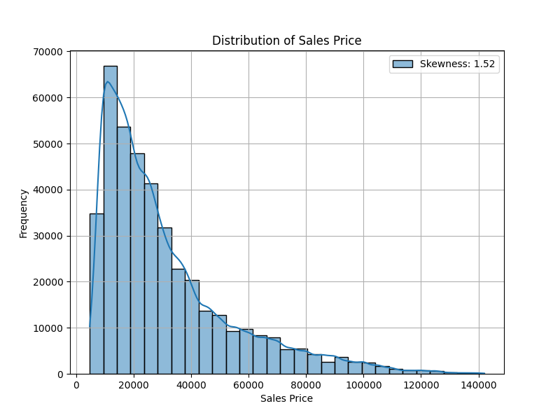
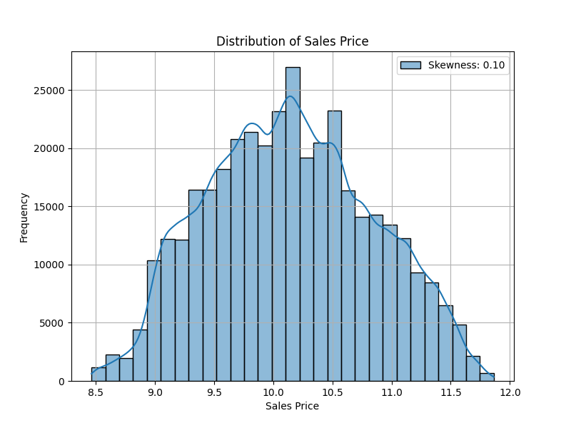
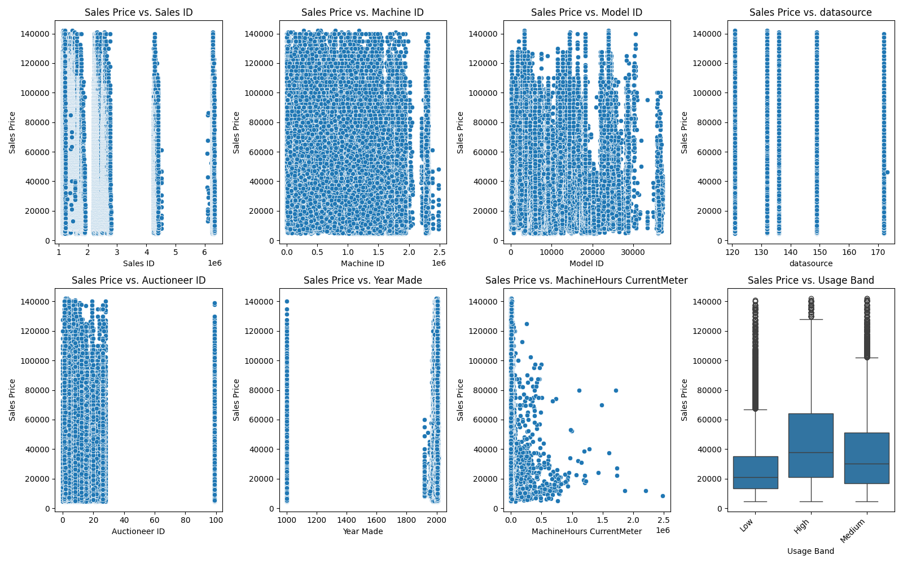
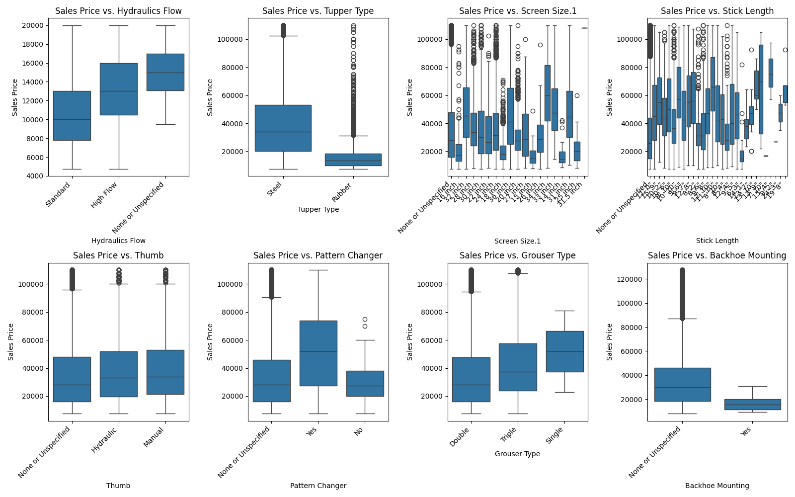
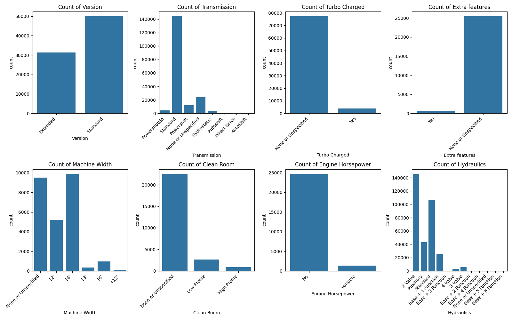
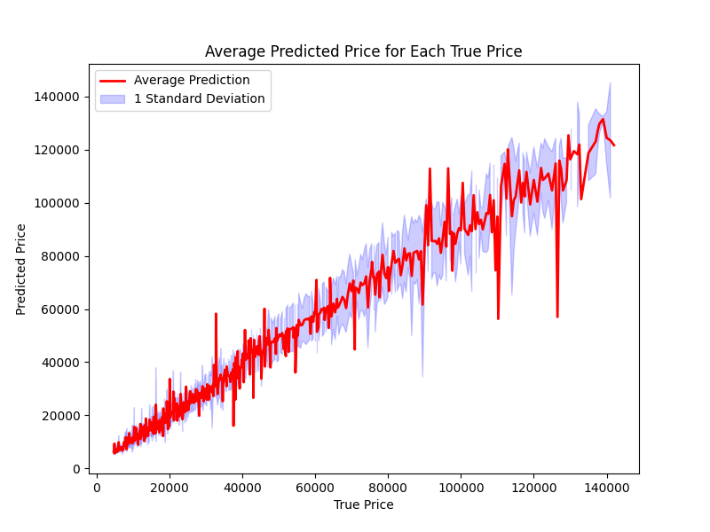

# Product Prediction using Machine Learning

## Setup

To setup the environment, please run the following command inside a virtual/conda environment:

```bash
pip install -r requirements.txt
```

## How to run the code 

To run the code, please run the following command:

```bash
python3 main.py
```

For more options, please run:

```bash
python3 main.py --help
```

The available options are:
```bash
usage: main.py [-h] [--data_path DATA_PATH] [--visualize_preprocessing] [--visualize_postprocessing]
```
The ```--data_path``` option is used to specify the path to the data file, the default is ```data/machines.csv```.

The ```--visualize_preprocessing``` option is used to visualize the data before the preprocessing step. The plots
are kept in the ```visualizations/prefeature``` folder. There is not need to show them with an interactive plot, since it
is for analysis purposes.

The ```--visualize_postprocessing``` option is used to visualize the data after the preprocessing step. After preprocessing,
the data should be mostly well distributed and ready to be used by the model, so, in fact, the graphs are only to confirm
if the preprocessing was done correctly and to check the correlation between the features and the target.
The plots are kept in the ```visualizations/postfeature``` folder. There is not need to show them with an interactive plot,
since it is for analysis purposes.


## Data Analysis, Preprocessing and Visualization

The ```machines.csv``` contains the following columns:

```csv
Sales ID, Sales Price, Machine ID, Model ID, datasource, Auctioneer ID, Year Made, 
MachineHours CurrentMeter, Usage Band, Sales date, Model Description, Base Model, 
Secondary Description, Model Series, Model Descriptor, Machine Size, Product Class Description, 
State of Usage, Product Group, Product Group Description, Driver System, Enclosure, Control, 
Touchpad Type, Control Type, Version, Transmission, Turbo Charged, Extra features, Machine Width, 
Clean Room, Engine Horsepower, Hydraulics, Push Block, Ripper, Scarifier, Tip Control, Screen Size, 
Coupler, Couple System, Grouser Tracks, Hydraulics Flow, Tupper Type, Screen Size.1, Stick Length, 
Thumb, Pattern Changer, Grouser Type, Backhoe Mounting, Blade Type, Travel Possibilities, 
Differential Type, Steering Controls
```

The main goal of this project is to predict the sales price of the machines based on the given features, hence
we should first analyze the distribution of the sales prices:

[](visualizations/prefeature/distribution_sales_price.png)

As we can see, the sales price is left-skewed, hence we should apply a log transformation and a standardized normalization to make it more normally distributed
in order to improve the performance of any model that we will use. With that in mind, we can see the distribution of the sales price after applying the log transformation:

[](visualizations/prefeature/distribution_sales_price_log.png)

It is also important to take into account the relation of the variables with the sales price, for example, the ```Year Made``` feature:

[](visualizations/prefeature/sales_price_vs_features_1.png)

It can also help to identify outliers. For example, in the above image, we see products that were made in the year 1000, which is not possible, hence we should remove these outliers.

Additionally, more trends can be seen for example:

[](visualizations/prefeature/sales_price_vs_features_6.png)

Besides that, it is important to analyze the counts of the different categories of the categorical features to see if there are any categories that are underrepresented, have a very low count or that
are undefined and, hence, should be removed or filled with the mean value:

[](visualizations/prefeature/count_categorical_features_3.png)

For more plots and analysis, please refer to the ```visualizations/prefeature``` folder. Where prefeature refers to the analysis before any preprocessing.

### Feature Engineering and Preprocessing

With the baseline analysis done, we can now proceed to the feature engineering part. In this part, we will add
new features, remove outliers, fill missing values, and encode the categorical features. For example, we can add a new feature. 

For the purpose of ```sales``` prediction, it is important to split the date of the sale into year, month, day and day of the week, as these features can have an impact on the sales price. Additionally, we can add a Quarter feature, as the sales price can vary depending on the quarter of the year as demonstrated in financial reports.
Since the months can represent cyclic behavior across years, we can try to encode them as sin and cos functions to capture this cyclic behavior as it is done in time series analysis or in embeddings in LLMs.

We also don't have directly the age of the machine, hence we can calculate it by subtracting the year made from the year of the sale. We also don't have information about the usage intensity of the machine, hence we can calculate it by dividing the machine hours current meter by the age of the machine.

Finally, the 'Product Class Description' has the following information as an example: Type E - 110.0 to 120.0 Horsepower.
This can be separated into: Type, Min Value, Max Value and Units, since we can have Horsepower, Metric Cubics, etc. This
can be done using a regex expression to extract the information.

For the preprocessing part, we encode all the categorical features, fill the missing values with the mean value, remove
outliers and unnecessary features such as ```Sales ID```, apply the log transformation to the price sale and the standard normalization. After this, the new data can also be saved in a new csv file: ```processed_data.csv```.

## Model Selection and Training

This problem has two main key points: Is a tabular data with both continuous and categorical features and the target is a regression problem. Hence, any of the following models can be used, since they are suitable for this type of problem:
Random Forest, Gradient Boosting, or XGBoost.
A neural network can also be used, but it is not the best choice for this type of problem, since it is more computationally expensive, requires more data to train, more hyperparameters to tune and it is more prone to overfitting. The main idea is:
*there is no need to kill an ant with a bazooka.*

For the purpose of this project, I chose the LightGBM model, since it is a gradient boosting model that is faster to train,
specially in a CPU based environment as it is the case here, and it has a better performance than Random Forest and XGBoost.
For more information on the ```LightGBM``` model, please refer to the following link: https://lightgbm.readthedocs.io/en/latest/

For this case, I choose the following hyperparameters to start the training:
* n_estimators = 1000
* num_leaves=100

## Evaluation

Since we are dealing with a regression problem, the main metric I used to evaluate the model is the R2 score. It provides a measure of how well the model's predictions match the actual data. It ranges from 0 to 1, with a value closer to 1 indicating a better fit and a value closer to 0 suggesting a poor fit. A high R2 score indicates that the model is able to explain a large proportion of the variance in the target variable, while a low R2 score implies that the model is not capturing the underlying patterns effectively.

Additionaly, I also used the Mean Squared Error (MSE) and the Mean Absolute Error (MAE) to evaluate the model and the
Average Percentage Error (APE) to evaluate the performance of the model in terms of the percentage of error. However, since
the price goes from around 20.000 to 140.000, few outliers can have a big impact on those metrics, e.g., a deviation of
10% on the price of a 20.000 machine is 2.000, while a deviation of 10% on the price of a 140.000 machine is 14.000 which
is 7 times bigger than the previous case. Hence, the best metric to evaluate the model is the R2 score.

## Results

After training the model with the given hyperparameters, the following results were obtained:
*  R2 Score: 0.9172410498643722
*  MAE: 4209.631077881091
*  RMSE: 6727.124838683581
*  Average % Error: 14.24%

The R2 score is close to 1, which indicates that the model is able to explain a large proportion of the variance in the target variable. The MAE and RMSE values are also relatively low comparing with the price range of the machines, about
20.000 to 140.000, which indicates that the model is making accurate predictions. The Average % Error is also considered low. As in any Machine Learning project, we don't want to overfit the model and we want to generalize well, hence achieving
100% accuracy is not the goal, but to have a model that can generalize well to unseen data.

The following plot can be used to visualize the test data and the predictions made by the model:

[](images_readme/prediction_distribution.png)

The results are satisfactory, hence there is small need to tune the hyperparameters, however, this can be done by using a
Bayesian Optimization method library, for example, Optuna, to find the best hyperparameters for the model.

